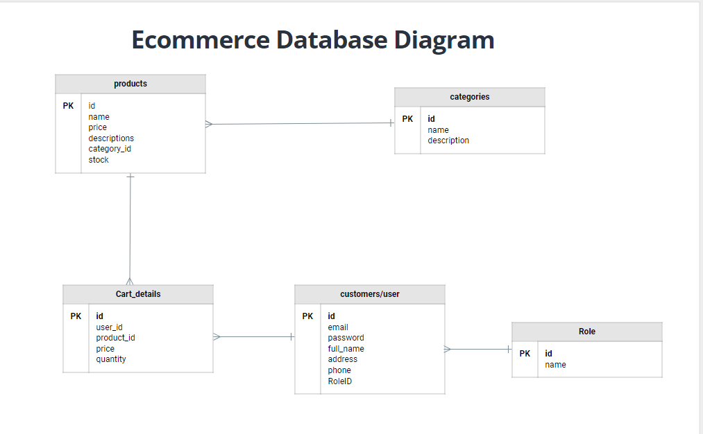
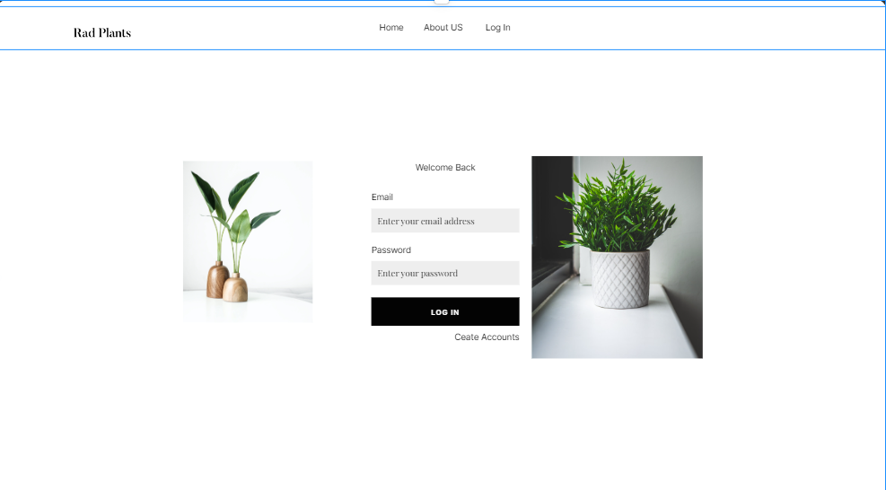
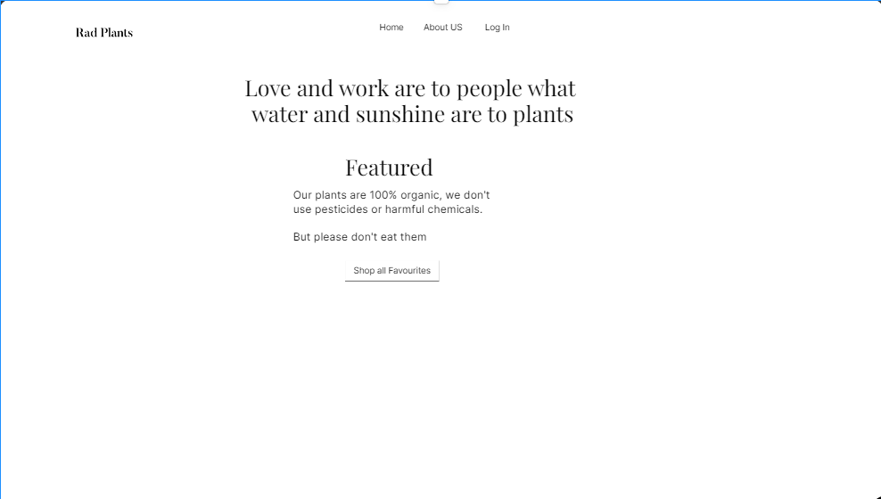
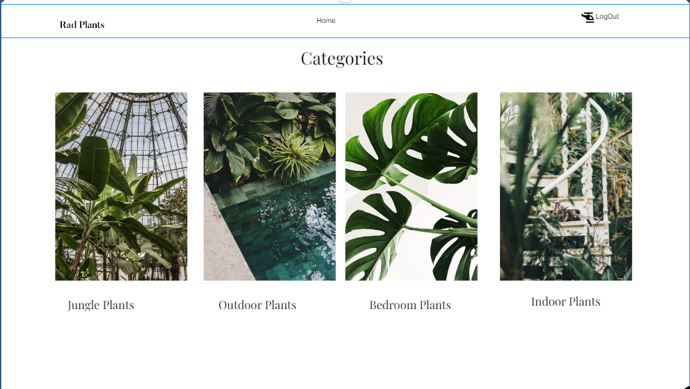
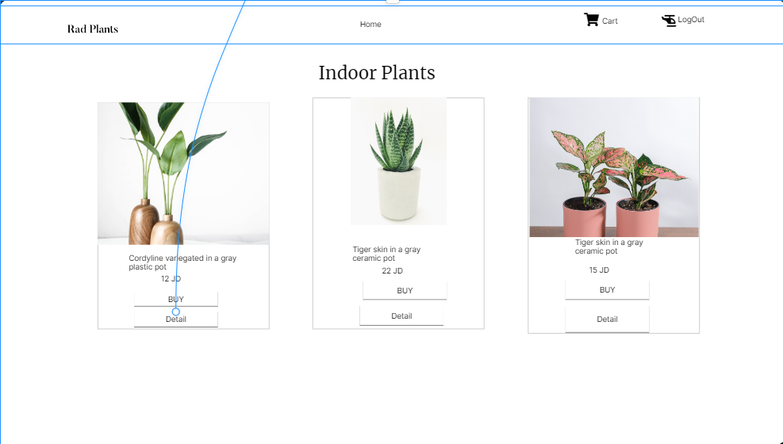
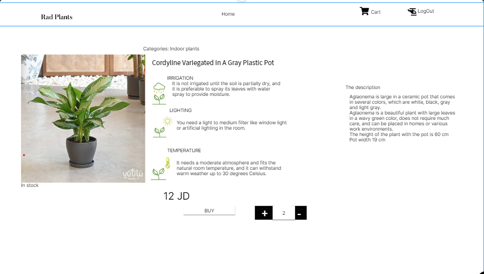

# E-Commerce-App
E-Commerce-App Selling plants

## User Stories and Tasks
1. Admin Dashboard:
 - product"plants": (add, delete, update)
 - cart: (show all carts for user)
 - category: (add, delete, update)

2. User Stories and Tasks
 - product"plants": (add to cart, show)
 - category: (show)
 - cart: (show all products it buy it)

=========================================================================================================================

## ERD

=========================================================================================================================
## Wireframe

lap 30 

A deployed link to your azure website
https://e-commerce-app99.azurewebsites.net/

Collaborate and come up with
What you did well   
1.  create an MVC project
2. reflect all tables into the model and make the serves and InterFace and all controllers with injection
3. add view Admin Dashboard 
4. push the website into the Azure DevOps Process 
5. use all frontEnd experiences to make the best design for the pages

What you will do differently next sprint
1. Registration Page
2. Home Page
3. Products Page
4. Mini Cart  and Cart
5.Auth.NET/Checkout Process

Do you need anything from the instructional staff?  NULL

