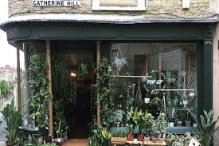

# E-Commerce-App
E-Commerce-App Selling plants

## User Stories and Tasks
1. Admin Dashboard:
 - product"plants": (add, delete, update)
 - cart: (show all carts for user)
 - category: (add, delete, update)

2. User Stories and Tasks
 - product"plants": (add to cart, show)
 - category: (show)
 - cart: (show all products it buy it)

=========================================================================================================================

## ERD

=========================================================================================================================
## Wireframe

lap 30 

A deployed link to your azure website
https://e-commerce-app99.azurewebsites.net/

Collaborate and come up with
What you did well   
1.  create an MVC project
2. reflect all tables into the model and make the serves and InterFace and all controllers with injection
3. add view Admin Dashboard 
4. push the website into the Azure DevOps Process 
5. use all frontEnd experiences to make the best design for the pages

What you will do differently next sprint
1. Registration Page
2. Home Page
3. Products Page
4. Mini Cart  and Cart
5.Auth.NET/Checkout Process

Do you need anything from the instructional staff?  NULL

lap 35

A deployed link to your azure website
https://e-commerce-app99.azurewebsites.net/
1. Collaborate with each other and come up with
A)What you did well
 1. Registration Page
 2. Home Page
 3. Products Page
 4. Mini Cart  and Cart
 5.Auth.NET/Checkout Process
B)What you will do differently next sprint
Fix all errors that may appear or have already appeared

Lap 40

1) Readme should contain the following:
======================================================
A) Introduction to your E-Commerce site
 Rad Plant shop

Find the perfect plants for your home  Beautiful plants that encourage you to get creative.
A store that specializes in indoor and outdoor ornamental plants and their accessories
Our plants are 100% organic, we don't use pesticides or harmful chemicals. But please don't eat them.
==================================================

B)What is the product you are selling?  indoor and outdoor ornamental plants
=====================================================
C) What claims are you capturing? Why? 
   1. admin CRUD FOR ALL Model and see the orders that the Customer make it
   2. Editor see the categories and the products and make the order action
============================================

D) Structure/Database Schema for your store DB (not identity)
 it OK
====
E) Explanation of your DB Schema (mostly interested in your basket/order tables)
 1. Categorie :
   1. id 
   2. CategoryName
   3. CategoryDescription
2. Product
 1. Id
 2. Name
 3. price
 4. Description
 5. stock
 6. Product Image
 7. Category Id
3. Order
 1. Id 
 2. username 
 3. Items (list of Products and their Quantity )
 4. Total 
 5. DateTime 
================================================

F) Link to your deployed website
https://e-commerce-app99.azurewebsites.net/

==================================
G)Name of Contributors
  A) Waseem Abdallah Abuameer
  B) Ahmad  Muhammed Masadeh
